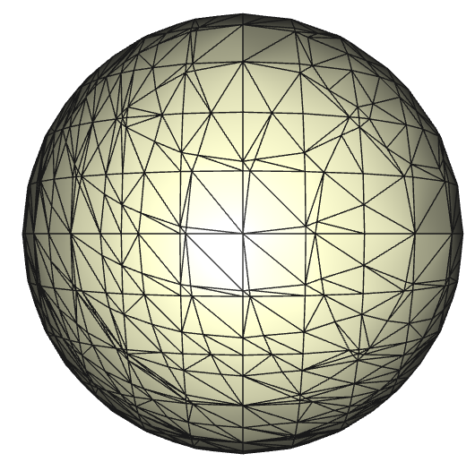
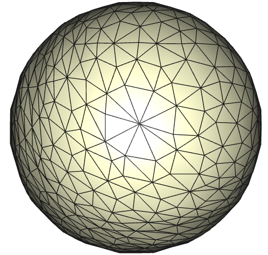
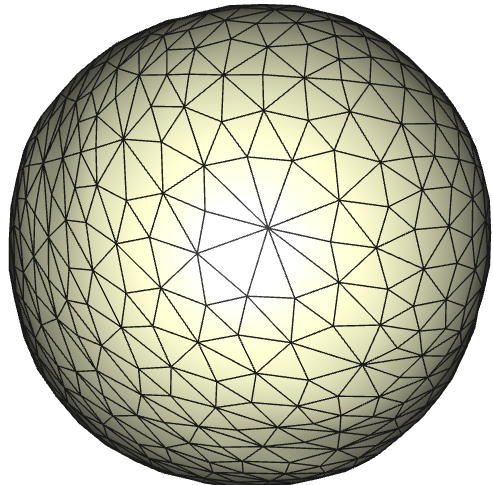
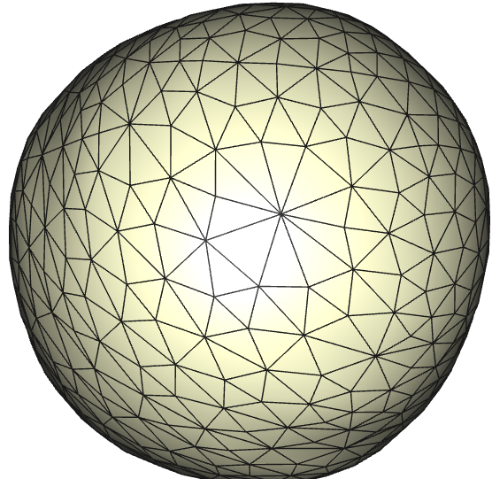

# remesher-3d

## **Building:**
1. This project was built in `flux`. This geometric library can be downloaded at https://gitlab.com/csci422-s22/flux-base
2. Build `flux` and then create a new folder in the projects section
3. This library also makes use of my library `marching-tetrahedra` to obtain imperfect meshes. It is not necessary, but to run the main emthod provided, you need to download https://github.com/dborah123/marching-tetrahedra into the projects folder of flux
4. Download `remesher-3d` into this new folder
5. Build/make `flux` again and go to `build/debug/projects/marching-tets`
6. Run command `make marchingtets_exe` to make and `./marchingtets_exe` to run

## **Tangential Relaxation**
### **Description:**
Tangential relaxation is not a typical remeshing algorithm as it does not create or delete any edges. Rather, it merely moves the vertices, making the mesh more uniform.

**Steps:**  
1. Loop through the vertices of the mesh
2. For each vertex, get the new coordinates p' through this equation: p' = q + dot(n, (p - q)) * n . n is the average of the face normals of the onering of p (the original coordinates). q is the average of the onering around p.
3. With these new coordinates, save them in a map that maps vertex to coordinates.
4. After every vertex's new coordinates ahve been calcualted and stored, go back through the vertices and change each one to the new, calculated one.  

## **Results:**
Our inputs were a sphere created using my `marching-tetrahedra` library that can be found [here](https://github.com/dborah123/marching-tetrahedra). This sphere has a center at (0.5, 0.5, 0.5), a radius of 0.4, and was made using a tetrahedra grid of 10x10x10.

**0 Iterations:**  
  
This is our starting mesh. While it is valid, it lacks uniformity amongst the areas of its faces as well as its edge lengths.

**1 Iteration:**  

As you can see, after one iteration, thej sphere looks much more uniform. Aside from a few edge lengths being a little long, it maintains its spherical shape and uniformity.

**5 Iterations:**  
  
With this iteration, the triangles look quite equilateral. Yet, one can notice the sphere isn't exacactly spherical in certain places due to the algorithm.  

**10 Iterations:**  
  
Given an input of 10 iterations, one can notices a decrease in the quality of the overall form of the sphere. This algorithm does npt account for the original shape of the mesh necessarily.  

**Conclusion**
This algorithm works well on a limited scale. Yet as more iterations occur, the diregard for the original shape is apparent. If I had to do this again, I would go through the vertices after and align them with the analyical function somehow.